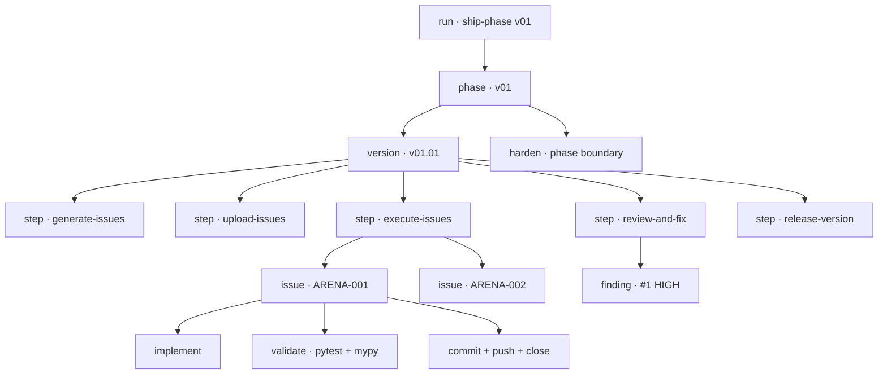

# Tracking `/ship-phase` — design vision

**Status:** proposal. Nothing described here is built yet.
**Scope:** how to make a `/ship-phase` run observable while it runs, and what to render from it.

---

## 1. The problem

`/ship-phase` is a long, deeply nested, mostly-silent process. A single `/ship-phase v01` run walks
four versions, each through six steps, each step through 3–7 issues, each issue through
implement → validate → commit → push → close. That is on the order of a hundred meaningful state
transitions — and today **exactly one of them reaches the user**: the per-phase chat report, emitted
after everything has already happened.

The sibling orchestrator is no better. `/ship-solution` stamps `date +%s` per version and writes a
single report at the end. Both hold their statistics **in memory** until the run finishes.

Three consequences:

- **No live signal.** A 40-minute run is indistinguishable from a hung one.
- **A crash loses everything.** In-memory statistics die with the run. `ship-solution`'s own
  instructions half-acknowledge this — "persist rows as you go so a long run never loses a
  measurement" — but nothing else does.
- **Failures leave no trace at all.** This is the sharpest gap. When an issue fails validation,
  `execute-issues` Step 3 reverts with `git checkout -- .` and moves on. The attempt is erased: no
  commit, no file, no record. **The single most valuable signal in the whole pipeline — what the model
  got wrong on the first try — is the one thing currently guaranteed to be unrecoverable.**

That last point decides the architecture. Any approach that reconstructs history after the fact (from
git, from the reports) is structurally blind to failed attempts. **Tracking has to be emitted in
flight.**

---

## 2. What a run actually is

A `ship-phase` run is a strict tree. Every node has a start, an end, a status, and a payload.



The tree is the schema. Everything the dashboard wants to show — progress, throughput, where time
goes, what failed — is a query over this tree plus timestamps.

---

## 3. Design principles

1. **Append-only, on disk, immediately.** Every event is one line appended to a JSONL file the moment
   it happens. Crash-safe, tailable, trivially parsed, no database.
2. **Emission must never gate the pipeline.** A failed write, a full disk, an absent dashboard — none
   of it may fail a step or change what gets built. Tracking observes; it never participates.
3. **Record attempts, not just outcomes.** Failed validations, reverts, retries and held findings are
   first-class events. They are the point.
4. **Derive nothing that can be observed.** Prefer an explicit event over inferring from git later.
5. **The dashboard is a renderer.** It holds no authority and no state of its own — exactly the
   Player/Observer split the tracked application itself uses. Delete it and the run is unaffected.

---

## 4. The event log

One run, one directory:

```
codegen/runs/<run-id>/
  events.jsonl      append-only, the source of truth
  state.json        derived snapshot, rewritten on each event (cheap dashboard bootstrap)
codegen/runs/current -> <run-id>    so any sub-skill can find the active run
```

`codegen/runs/` is gitignored — runs are data, not source. A curated run may be promoted deliberately.

### Event shape

```json
{
  "seq": 147,
  "ts": "2026-08-03T14:22:31.482Z",
  "run_id": "run-20260803-142012",
  "type": "issue.validate.end",
  "scope": { "phase": "v01", "version": "v01.01", "step": "execute-issues", "issue": "ARENA-003" },
  "status": "fail",
  "data": {
    "pytest": { "passed": 41, "failed": 1, "duration_s": 6.1 },
    "mypy": { "errors": 0 },
    "attempt": 1
  }
}
```

`seq` is a monotonic counter — it orders events even when timestamps collide. `scope` is the path
through the tree, so any event can be attributed without parsing what came before. `status` is one of
`ok` / `fail` / `skip` / `held`.

### Event types

| Group | Types |
|---|---|
| Run | `run.start` · `run.end` · `run.aborted` |
| Phase | `phase.start` · `phase.end` |
| Version | `version.start` · `version.end` · `version.skipped` |
| Step | `step.start` · `step.end` · `gate.blocked` |
| Issue | `issue.start` · `issue.implement.end` · `issue.validate.end` · `issue.commit` · `issue.failed` · `issue.reverted` · `issue.end` |
| Review | `finding.raised` · `finding.classified` · `finding.fixed` · `finding.deferred` |
| Harden | `harden.offered` · `harden.declined` · `harden.finding.fixed` · `harden.finding.held` |
| Release | `release.tagged` · `release.pushed` |

`gate.blocked` deserves emphasis: `ship-phase`'s gates are its whole contribution as an orchestrator,
and a blocked gate is the clearest possible explanation of why a run stopped.

---

## 5. Where the events come from

Three sources, each covering the others' blind spots.

### a. Skill-emitted — the semantics

The sub-skills gain an emit instruction at the points that already exist as discrete steps. These are
the only source that knows *meaning* — that this Bash call was "validating ARENA-003, attempt 2".

| Skill | Existing step | Event |
|---|---|---|
| `ship-phase` | Step 0 baseline | `run.start` (+ baseline test count) |
| `ship-phase` | Step 1 per version | `version.start` / `version.end` |
| `ship-phase` | Step 1 gates | `gate.blocked` |
| `execute-issues` | 2a announce | `issue.start` |
| `execute-issues` | 2d validate | `issue.validate.end` |
| `execute-issues` | 2e commit | `issue.commit` |
| `execute-issues` | Step 3 failure | `issue.failed` + `issue.reverted` ← **the erased path** |
| `review-and-fix-issues` | Step 2 doc | `finding.raised` / `finding.classified` |
| `review-and-fix-issues` | Step 4 update | `finding.fixed` |
| `harden-findings` | Step 1 loop | `harden.finding.fixed` / `.held` |
| `release-version` | Steps 5–6 | `release.tagged` / `release.pushed` |

**Weakness:** compliance is soft. A model following a long skill file may skip an emit under pressure,
and the gap is silent.

### b. Hooks — the deterministic spine

`PreToolUse` / `PostToolUse` / `Stop` hooks in `.claude/settings.json` are executed by the harness, not
the model. They **cannot be forgotten**. They see every Bash command, every file write, every `gh`
call, with real timestamps.

They cover exactly what (a) is weak at — guaranteed timing and guaranteed occurrence — and are blind
to exactly what (a) is good at: they see `pytest -q` run, not that it was ARENA-003's second attempt.

**Use hooks as the clock and the floor.** If a skill forgets `issue.validate.end`, the hook still
recorded that pytest ran, when, and with what exit code. Reconciliation can flag the discrepancy —
which is itself a useful measurement of skill compliance.

### c. Git — the ground truth

One issue = one commit is already enforced. After a run, `git log` independently confirms what landed.
Useful for reconciling the log against reality, and for catching the case where the log claims a commit
that does not exist. **Never sufficient alone** — reverted attempts are invisible to it.

> **The composition:** hooks give a spine that cannot be forgotten, skills give it meaning, git proves
> it afterwards. No single source is trusted for everything.

---

## 6. The dashboard

A small FastAPI process, independent of the generated `server/`, that tails `events.jsonl` and pushes
each new event over a WebSocket to a vanilla HTML/CSS/JS page — no build step.

This deliberately mirrors the architecture of the application being generated: an authoritative server
pushing events to a stateless renderer. The symmetry is convenient (the patterns are already specified
in `spec/architecture.md`) but the coupling must stay at zero — `codegen/` imports nothing from
`server/`, and survives the working tree being cleared.

**What it shows**

- **Live tree** — run → phase → version → step → issue, each node with elapsed time and status. The
  currently-executing node is obvious at a glance.
- **Throughput** — issues completed per hour; time distribution across implement / validate / commit.
- **Failure surface** — every `issue.failed`, its attempt number, and what the validator said. Over
  multiple runs this becomes the most interesting artifact in the project: *where does generation
  actually go wrong, and does it go wrong in the same places?*
- **Quality flow** — findings by severity, fix-now vs deferred, and what the harden sweep later closed.
- **Suite trajectory** — test count and duration climbing version by version.

**Cross-run comparison** is where this earns its keep. One run is an anecdote; the same phase generated
five times, with the variance in duration, retry count and failure location, is data.

---

## 7. Build order

Each step is independently useful — none is a prerequisite for the run itself working.

1. **Schema + emit helper + log location.** A tiny appender and the `codegen/runs/` layout. No skill
   changes yet.
2. **Instrument the `ship-phase` spine** — `run`/`phase`/`version`/`step` events only. Smallest change
   that produces a real timeline.
3. **Instrument `execute-issues`** — issue-level events, especially the failure path. Highest
   information-per-event in the whole pipeline.
4. **Add hooks** for the deterministic floor, and a reconciliation check against (1)–(3).
5. **Dashboard** — tail, WebSocket, vanilla page.
6. **Cross-run history and derived metrics.**

Steps 1–3 already yield everything `ship-solution`'s end-of-run report contains, except available
*during* the run and surviving a crash.

---

## 8. Open questions

- **Run context propagation.** `ship-phase` invokes sub-skills through the Skill tool; a sub-skill has
  no inherent knowledge of the run it belongs to. The `codegen/runs/current` pointer is the proposed
  answer, but it makes concurrent runs unrepresentable. Acceptable for now — worth naming.
- **Unterminated spans.** A run killed mid-flight leaves `*.start` with no matching `*.end`. Either the
  dashboard infers abandonment from staleness, or a `Stop` hook writes `run.aborted`. The hook is more
  honest.
- **Cost and tokens** are not observable from inside the run. If they matter, they have to come from
  outside — and may simply be out of scope.
- **Observer effect.** Emission instructions lengthen every skill file, and skill files are prompts.
  Adding a hundred lines of tracking instruction could measurably change what gets generated. Keep
  emit instructions to one line per site, and treat any growth in skill length as a cost.
- **What counts as a "run"** when a phase is resumed after a failure — a new run linked to the old, or
  a continuation of it? Affects every cross-run comparison.
