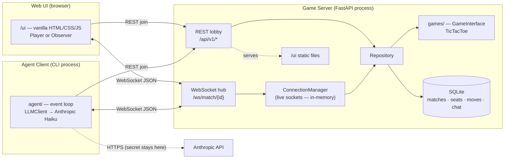
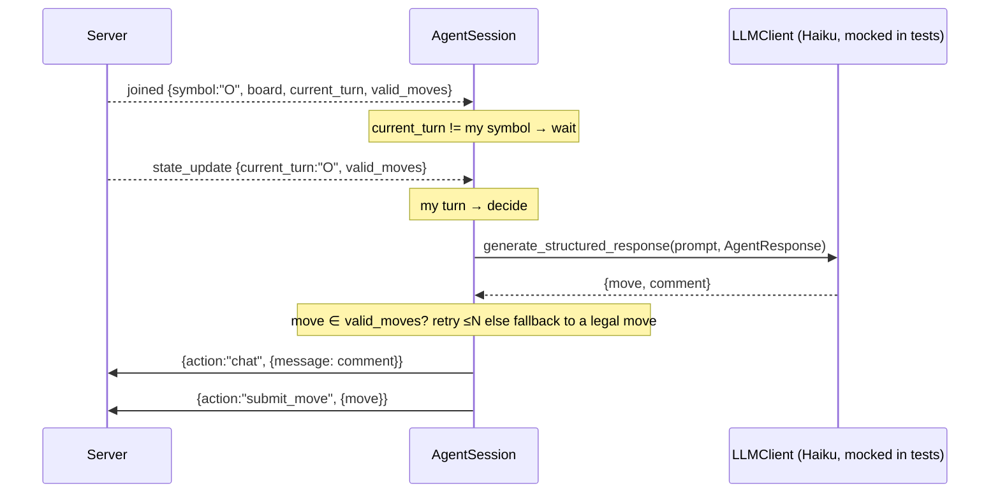

# Architecture — AgentArena

This document is the **detailed technical design** that implements the vision in
[game_specification.md](game_specification.md). Where the vision states *what and why*, this
states *how*: module layout, the stable seams, the exact wire contracts, the identity/authority
model, and the concurrency/state model.

Scope tracks the vision's §2 table: **MVP is Haiku-only, one live match, SQLite-backed state, vanilla
Web UI**. Anything marked *later* below is designed-for but not built.

> **Contract-stability rule.** The three stable seams are (1) the WebSocket JSON event/action
> schemas (§6.2), (2) `GameInterface` (§4.1), and (3) `LLMClient` (§4.2). Any change to one of
> these must update **this document and its contract test in the same commit.**

---

## 1. Component Overview

Three processes, one authority. The server owns all state; clients are thin.



- **Game Server** — the single source of truth: match state, seat identity, move legality, event
  routing. FastAPI + WebSockets, fully async, **SQLite-backed** state (SQLAlchemy async +
  `aiosqlite`) via a `Repository`. The only in-memory state is the set of live WebSocket sockets.
- **Agent Client** — a standalone Python CLI. Waits for its turn, prompts Haiku, submits a
  structured `{move, chat}`. The API key never leaves this process.
- **Web UI** — a stateless browser renderer served by the server at `/ui`.

---

## 2. Module & Directory Layout

```text
agent-arena/
├── server/                 # Game Server (FastAPI)
│   ├── main.py             # app, lifespan (init_models), REST routes, WS endpoint, static mount, middleware
│   ├── websockets.py       # ConnectionManager, event/action envelopes, message handlers
│   ├── database.py         # async engine + session maker, FK PRAGMA, init_models()
│   ├── models.py           # SQLAlchemy ORM: Match, Participant, Move, ChatMessage
│   ├── repository.py       # Repository — all DB reads/writes; seat assignment; game reconstruction
│   ├── match.py            # seat rules + current_turn/board reconstruction over the Repository
│   ├── auth.py             # token issue/validate, IssuedToken
│   └── schemas.py          # Pydantic request/response models for REST + WS payloads
├── games/                  # Pluggable game modules (import nothing from server/)
│   ├── interface.py        # GameInterface (abstract)
│   └── tictactoe.py        # TicTacToe implementation
├── agent/                  # Agent Client (CLI)
│   ├── agent.py            # entrypoint, arg parsing, WS event loop, AgentSession
│   ├── llm.py              # LLMClient seam + AnthropicHaikuClient + create_llm_client()
│   ├── prompt.py           # persona + memory + board → prompt
│   ├── memory.py           # MemoryWindow (rolling recent moves/chat)
│   ├── profile.py          # AgentProfile (YAML loader)
│   └── schemas.py          # AgentResponse ({move, comment})
├── web/                    # Web UI (served at /ui)
│   ├── index.html
│   ├── styles.css
│   └── app.js              # one WebSocket; routeEvent() dispatcher
├── profiles/               # Sample persona YAMLs (the "Agent Designer" output for MVP)
│   ├── aggressive.yml
│   └── cautious.yml
├── scripts/                # run_arena.sh — launches an agent-vs-agent match
└── tests/                  # flat pytest suite mirroring the packages
```

**Package boundaries (enforced by discipline, not tooling):**
- `games/` imports nothing from `server/` — it is pure logic behind `GameInterface`.
- `agent/` imports nothing from `server/` — it talks to the server only over HTTP/WS, exactly as
  the Web UI does. This keeps the agent a true external client.
- The "Agent Designer" (vision §5.2) is realized for the MVP as `AgentProfile` + `profiles/*.yml`;
  a richer generator package is *later*.

---

## 3. Server Application Structure

`server/main.py` builds the FastAPI app with a `lifespan` context (no deprecated startup hooks):

- **REST routes** under `/api/v1/*` (§6.1).
- **WebSocket route** `GET /ws/match/{match_id}` (§6.2).
- **Static mount** `app.mount("/ui", StaticFiles(directory=web, html=True))`.
- **Middleware:** `Cache-Control: no-store` on `/ui/*` responses (prevents the browser from serving
  stale JS/CSS during development); permissive CORS for local dev.

**Persistence layer** (`server/database.py`): an async SQLAlchemy engine over
`sqlite+aiosqlite:///./arena.db` (path config-driven; the `.db` file is gitignored), an
`async_sessionmaker(expire_on_commit=False)`, and a connect-time `PRAGMA foreign_keys=ON` so the
foreign keys in §5.1 are enforced. `lifespan` calls `init_models()` on startup to create tables.
All durable state (matches, seats, moves, chat) lives in SQLite and **survives a server restart**;
it is reached only through the `Repository` (§5.2), never by ad-hoc SQL scattered across handlers.

---

## 4. Core Seams

### 4.1 `GameInterface` — the game plug-in seam

The only way a game enters the system. A game module implements this and is otherwise fully
decoupled from transport.

```python
class GameInterface(ABC):
    @abstractmethod
    def get_state(self) -> dict[str, Any]:            # structured board, e.g. {"board": [...]}
        ...
    @abstractmethod
    def get_valid_moves(self) -> list[Any]:           # legal moves for the player to move
        ...
    @abstractmethod
    def apply_move(self, player: str, move: Any) -> bool:   # validate+apply; False if illegal
        ...
    @abstractmethod
    def is_game_over(self) -> str | None:             # "X" | "O" | "draw" | None (ongoing)
        ...
```

Rules:
- **The move payload is opaque to transport.** For TicTacToe it is an `int` cell `0–8`; a future
  chess module might take algebraic notation. Only the game module interprets/validates it — the
  WS layer, server, and UI pass it through unexamined.
- `apply_move` is the **sole legality authority**. It returns `False` for anything illegal
  (out-of-range, occupied, wrong type) and never raises on bad input.
- New games are **new modules**, never generalizations of an existing one.

`TicTacToe`: 9-cell list, `X` moves first, 8 winning lines, `"draw"` when full with no line.

### 4.2 `LLMClient` — the model-vendor seam

The only way the agent talks to a model. Keeps agent logic free of any vendor SDK.

```python
T = TypeVar("T", bound=BaseModel)

class LLMClient(ABC):
    @abstractmethod
    async def generate_structured_response(self, prompt: str, schema: type[T]) -> T:
        """Return an instance of `schema`, forcing the model to structured output."""

class AnthropicHaikuClient(LLMClient):     # the ONLY implementation for now
    # model id is a single config constant (e.g. "claude-haiku-4-5"); confirm against the
    # live model list rather than hardcoding a guessed id.
    ...

def create_llm_client(model_type: str, api_key: str, temperature: float) -> LLMClient:
    # config-driven vendor selection, keyed off AgentProfile.model_type.
```

Rules:
- The seam is **vendor-agnostic by design**; other vendors/tiers slot in as new `LLMClient`
  implementations behind `create_llm_client`. `agent/agent.py` never imports a concrete client.
- Structured output is enforced at the client (tool-use / JSON-schema), returning a validated
  `AgentResponse`; the caller never parses raw text.
- **Mocked by default in tests** so the suite is deterministic and free; live calls are permitted and opt-in.

---

## 5. Match, Seats & Authority

### 5.1 Data model & the Repository

Four tables (`server/models.py`), all reached through the `Repository` (`server/repository.py`) —
never via ad-hoc SQL in handlers:

| Table | Key columns | Purpose |
|---|---|---|
| `matches` | `match_id` (PK), `game_type`, `status` (`active`/`finished`), `result` (`X`/`O`/`draw`/null), `created_at` | one row per match |
| `participants` | `token` (PK), `match_id` (FK), `player_name`, `symbol` (`X`/`O`/null), `is_spectator`, `created_at` | seat identity — **`UNIQUE(match_id, symbol)`** ⇒ at most one X and one O |
| `moves` | `id` (PK), `match_id` (FK), `player_symbol`, `move` (opaque payload), `created_at` | the ordered move log — the **source of truth** for board state |
| `chat_messages` | `id` (PK), `match_id` (FK), `sender`, `message`, `created_at` | chat history (non-authoritative) |

```python
class Repository:                              # all methods async, over one session
    async def create_match(match_id, game_type="tictactoe") -> None
    async def get_match(match_id) -> Match | None        # None ⇒ 404 at join
    async def add_participant(token, match_id, name, is_spectator) -> None
    async def assign_symbol(match_id, token) -> str | None   # seat rule (§5.2), write-through
    async def release_seat(match_id, token) -> None
    async def reconstruct_game(match_id) -> GameInterface    # replay moves → live game
    async def current_turn(match_id) -> str | None
    async def log_move(match_id, symbol, move) -> None
    async def log_chat(match_id, sender, message) -> None
```

**Live game state is reconstructed, not stored as mutable fields.** To answer *what is the board /
whose turn / is it over*, the Repository loads a match's `moves` in order and **replays** them
through a fresh `GameInterface` instance. Consequences:

- `GameInterface` stays minimal — **no serialize/deserialize** method is added; replay from the
  empty board suffices (≤9 moves for TicTacToe). A cached board-snapshot JSON column on `matches` is
  a clean *later* optimization if a heavier game needs it.
- `current_turn` is **derived** (TicTacToe: move-count parity, `X` on even) and is **`None` once
  `is_game_over()` is truthy** — so a reconnecting client re-learns the turn purely from state.
- Board and result survive a **server restart**, not just a client reconnect.

`server/match.py` is now just the thin seat/turn helpers over the Repository — there is **no
long-lived in-memory `Match` object**; each action runs against a DB session.

### 5.2 Seat identity — the non-negotiable rule

**A seat is keyed by `token` (the per-connection `participant_id`), never by display name.**
Two browser sessions can both be named `"Human"`; keying by name would silently merge them into one
seat. `Repository.assign_symbol(match_id, token)` reads/writes the `participants` row:

1. participant `is_spectator` → `None` (observers never get a seat, permanently).
2. participant already has a `symbol` → return it (idempotent reconnect).
3. two seats already taken for this match → `None` (match full).
4. otherwise assign the first free symbol and persist it — `UNIQUE(match_id, symbol)` guards against
   a race assigning the same symbol twice.

### 5.3 ConnectionManager

`server/websockets.py`:

```python
class ConnectionManager:
    _connections: dict[str, list[WebSocket]]   # match_id -> sockets
    _owners: dict[WebSocket, str]              # socket -> participant_id

    async def connect(match_id, ws, participant_id) -> None
    def disconnect(match_id, ws) -> None        # removes socket AND releases its seat
    async def broadcast(match_id, event) -> None  # serialize once; prune sockets that fail mid-send
    async def send_to(ws, event) -> None
    async def close_room(match_id) -> None       # close every socket in a finished match
```

`broadcast` computes the JSON payload once, then sends to each socket, pruning (and releasing the
seat of) any socket that raises mid-send — a dead client never blocks delivery to the rest.

### 5.4 Move authority flow

Every `submit_move` is re-validated server-side regardless of client claims:

1. `symbol = repo.seat_of(match_id, token)` — the seat this token **already holds**; `None` → `error`
   ("no seat"/observer). The move flow *reads* the seat, it never assigns one: seats are claimed once
   at WS connect (§6.2 `joined`), and assigning here would let the act of submitting a move grant a
   seat to a client who had none — an authority check that changes what it is checking.
2. reconstruct the game (`repo.reconstruct_game`); `symbol != current_turn` → `error` ("not your turn").
3. `game.apply_move(symbol, move)` returns `False` → `error` ("invalid move").
4. persist: `repo.log_move(...)`; if `game.is_game_over()` is now truthy, update the match row's
   `status="finished"` + `result`.
5. `broadcast(state_update)` (with `current_turn: null` if the game just ended).
6. if the game ended → `broadcast(game_over)` then `close_room`.

---

## 6. Transport Contracts

### 6.1 REST endpoints

| Method | Path | Body | Returns | Notes |
|---|---|---|---|---|
| `GET` | `/api/v1/health` | — | `{"status":"ok"}` | liveness |
| `POST` | `/api/v1/lobby/match` | — | `{"match_id": uuid}` | inserts a `matches` row |
| `POST` | `/api/v1/lobby/join` | `{match_id, player_name, spectator?}` | `{"token": ...}` | **404 if match unknown**; inserts a `participants` row; `spectator:true` → observer |

REST is used only for these non-real-time actions. Game state is **never** polled over REST.

### 6.2 WebSocket protocol

Connect: `GET /ws/match/{match_id}?token=<token>`. The server validates the token against the
match; a missing/invalid token → close with code `4001`.

**Envelopes.** Server→client: `{"event": <name>, "payload": {...}}`. Client→server:
`{"action": <name>, "payload": {...}}`.

**Server → client events:**

| Event | When | Payload |
|---|---|---|
| `joined` | once, right after connect | `symbol` (`"X"`/`"O"`/`null` for observer), `board`, `current_turn`, `valid_moves` |
| `state_update` | after every valid move | `board`, `current_turn` (`null` on the game-ending move), `valid_moves`, `last_move: {player, move}` |
| `chat_message` | after a chat action | `sender`, `message` |
| `game_over` | when the game ends | `result` (`"X"`/`"O"`/`"draw"`); server then closes the room |
| `error` | invalid/malformed message | `detail` |

**Client → server actions:**

| Action | Payload | Effect |
|---|---|---|
| `submit_move` | `{move}` | run the §5.4 authority flow |
| `chat` | `{message}` | broadcast a `chat_message` (non-authoritative flavor) |

**"Your turn" is a derived condition, not an event.** A client acts when a `joined` or
`state_update` arrives with `current_turn == its own symbol`. This refines the vision's illustrative
`your_turn` naming (§3.6) — it removes a redundant event and makes reconnection stateless (the
client recomputes its turn from any state message, so a missed event can't strand it).

### 6.3 Auth token

`server/auth.py` issues an opaque token at join and validates it at WS connect:

```python
@dataclass(frozen=True)
class IssuedToken:
    match_id: str
    player_name: str
    is_spectator: bool = False
```

The token **is** the `participant_id` (§5.2) and is the primary key of the `participants` row it
creates. For the MVP it is a random opaque id; a signed/JWT form is *later* and would not change the
seam. `is_spectator` is written onto the participant row at join, **before** any seat is assigned, so
an observer can never be handed a seat.

---

## 7. Agent Client Architecture

### 7.1 Decision flow

`agent/agent.py` runs one `AgentSession` over a single WebSocket:



- Acts only when `current_turn == self.symbol`. Observers of the protocol never act (an agent always
  holds a seat).
- **Retry/fallback:** if the model returns an illegal or unparseable move, re-prompt up to
  `MAX_MOVE_ATTEMPTS`; on exhaustion, play a random *legal* move rather than stalling the match.
- **CLI observability:** prints its reasoning/decisions to stdout (line-buffered so redirected logs
  flush promptly). Read-only — watching the CLI never changes play.

### 7.2 Prompt, memory, profile

- `AgentProfile` (YAML): `name`, `model_type` (→ `create_llm_client`), `temperature`,
  `system_prompt` (persona), `memory_limit`.
- `MemoryWindow`: a rolling buffer of the last *N* moves and chat messages.
- `prompt.py`: composes **persona + memory window + the pushed board & valid_moves** into one
  prompt. Because the server pushes full state (§6.2), the agent never round-trips to read state.

### 7.3 Structured output

```python
class AgentResponse(BaseModel):
    move: int          # opaque to transport; validated against valid_moves client-side then server-side
    comment: str       # the taunt/banter, broadcast as chat
```

---

## 8. Web UI Architecture

Vanilla HTML/CSS/JS, no build step, served at `/ui`. Holds **no authoritative state**.

- `app.js` opens one WebSocket and runs a single `routeEvent({event, payload})` dispatcher mapping
  each server event to a small render function (`renderBoard`, `renderChat`, `handleGameOver`, …).
- **Role is server-decided:** the join request sets `spectator`; a `joined` event with `symbol:null`
  renders the **Observer** view (board + chat visible, cells non-interactive, no chat posting). A
  `symbol` of `"X"`/`"O"` renders the **Player** view (cells clickable only when
  `current_turn === mySymbol`, chat enabled).
- Lobby controls: **Host**, **Join** (claims a seat), **Observe** (spectator). Board cells are real
  `<button>`s; disabled off-turn.

The full visual + behavioral contract is [web_ui_specification.md](web_ui_specification.md); the
visual design source is [ui_prototype.html](ui_prototype.html).

---

## 9. Identity, Authority & Security

- **Server is the ultimate authority.** LLM/client output is untrusted; every move re-validated via
  `GameInterface` (§5.4). A client may only move for the seat it was assigned.
- **Seats by token, never by name** (§5.2). **Observers never hold a seat** (§5.2).
- **Secrets isolation.** `ANTHROPIC_API_KEY` lives only in the agent's `.env`; it is never sent to,
  or logged by, the server or UI. The agent fails fast at startup if the key is missing.
- **Transport hygiene.** Bad token → WS close `4001`; malformed JSON → `error` event, connection
  kept; `no-store` on `/ui`.

---

## 10. Concurrency & State Model

- **Single async event loop.** uvicorn runs one event loop; each WS connection is an async task. The
  only in-memory shared state is `ConnectionManager`'s per-match socket lists, touched only from this
  loop (no `await` mid-mutation ⇒ no locks needed). All durable state is in SQLite.
- **SQLite writes serialize.** SQLite permits one writer at a time; `aiosqlite` runs it off the event
  loop. At MVP scale (one match, a handful of connections) contention is negligible; a busy-timeout
  and WAL mode are the first knobs if it ever matters. Seat races are additionally guarded by
  `UNIQUE(match_id, symbol)` (§5.1).
- **Session lifetime.** A DB session is opened per WS connection (`async with async_session_maker()`)
  and per REST request; `expire_on_commit=False` keeps returned ORM objects usable after commit.
- **Durability.** State survives both a client reconnect **and** a server restart (it lives in the
  `.db` file); active matches "rehydrate" for free because every read hits the DB.
- **Cleanup on disconnect.** WS handler cleanup runs in a `finally` block, not only on
  `WebSocketDisconnect`: **with a DB session open, a client-initiated drop can surface as an async
  cancellation rather than `WebSocketDisconnect`**, so only `finally` reliably releases the seat and
  removes the socket regardless of how the loop ended.

---

## 11. Testing Strategy

- **Unit** — `games/` logic (win/loss/draw, illegal-move rejection) directly against
  `GameInterface`, no server/network.
- **Contract** — pin the three seams: WS event/action shapes (§6.2), `GameInterface` (§4.1),
  `LLMClient` (§4.2). A seam change updates the contract test in the same commit.
- **Repository/DB** — Repository tests run against a **throwaway SQLite database** (a temp file or a
  fresh `:memory:` engine per test, with `foreign_keys=ON`), covering persistence, seat uniqueness,
  and reconstruction-by-replay without touching the dev `arena.db`.
- **Integration** — a real uvicorn server + real WebSocket connections exercising the full
  connect → play → `game_over` loop, including disconnect/observer paths (unit mocks miss
  connection-lifecycle bugs, e.g. the disconnect-as-cancellation case in §10).
- **The LLM is mocked by default** (`LLMClient` seam patched), which keeps the suite deterministic and
  free. Live calls are permitted for manual and end-to-end verification — opt in explicitly rather
  than letting the default suite depend on the network.

---

## 12. Deployment & Run Model

Local-first; three run modes, all against `uvicorn server.main:app`:

1. **Human vs agent** — start the server, open `/ui`, **Host** a match; run
   `agent/agent.py --match-id <id> --profile profiles/aggressive.yml`.
2. **Agent vs agent** — `scripts/run_arena.sh` creates a match and launches two agent processes with
   correct connection ordering (no seat races), printing the **Observe** link.
3. **Observe** — open `/ui`, **Observe** with a Match ID; watch board + chat, no seat claimed.

State persists to `./arena.db` (SQLite, gitignored via `*.db`) — it survives restarts; delete the
file to reset all matches. Containerization / cloud hosting are *later* and out of the MVP.

---

## 13. Design Decisions (rationale)

- **No `your_turn` event; derive the turn from state** (§6.2) — removes a redundant event and makes
  reconnection stateless.
- **Server pushes full state; agent replies once** (§7) — fewer round-trips, no stale-state
  reasoning, simpler agent.
- **Seat = token, not name** (§5.2) — the single highest-value correctness rule; keying by name
  collides on the UI's default `"Human"`.
- **`current_turn: null` on the terminal move** (§6.2) — so no client treats the game-ending
  `state_update` as an invitation to act into a room that's about to close.
- **SQLite via a Repository, board reconstructed from the move log** — durable across restart and
  gives move/chat history "for free," while keeping `GameInterface` minimal (no serialize step) and
  all DB access behind one seam. A board-snapshot column is a later optimization, not a contract change.

---

## 14. Out of Scope (designed-for, not built)

A **history-review UI/dashboard** over the persisted data; the **admin/observer dashboard** across
many matches; **multi-match at scale** and horizontal scaling (would move state out of a single
SQLite file, e.g. to Postgres, behind the same `Repository` seam); **additional games** (Connect 4,
Checkers, Chess) as new `games/` modules; **additional vendors/tiers** as new `LLMClient`
implementations; a richer **Agent Designer** generator; operator **co-pilot** input. Every one of
these lands behind an existing seam without breaking the §6 contracts.
```
